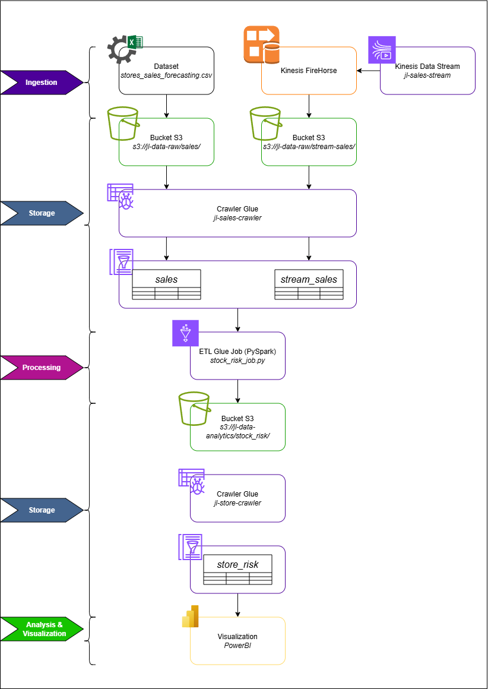
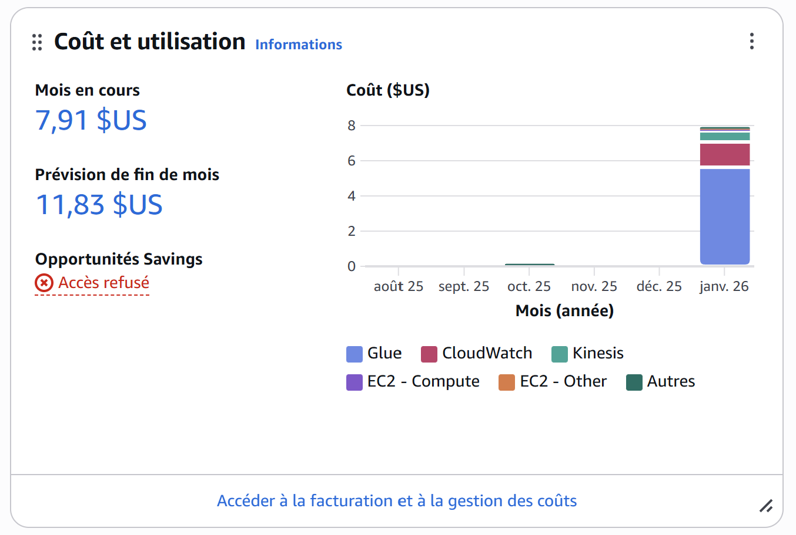

# Projet Pipeline de données

> Présentation de John WANG et Louis TRAN   Répo github : https://github.com/Silv-04/stock-data-pipeline   Vidéo présentation : https://youtu.be/lQCCXW4u4Qw  

---
## Gestion de rupture de stock

### 1. Contexte et cas d’usage

Le projet consiste à créer un pipeline de traitement de données sur AWS pour simuler et analyser les ventes d’un catalogue de produits. L’objectif est de collecter des ventes historiques et en temps réel, d’agréger les données, de calculer des indicateurs métier (quantité vendue, ventes moyennes journalières, stock estimé, niveau de risque), et de visualiser le tout sur un tableau de bord interactif.

Caractéristiques principales :

|  | | |
| - |- | - |
| Volume || Plusieurs milliers de produits issus d'un dataset **Kaggle** |
| Vélocité || Ingestion quasi temps réel via script Python et Kinesis |
| Variété || Données CSV historiques et JSON en streaming |
| Véracité || Suppression des lignes invalides, normalisation des colonnes |
| Valeur || Indicateurs exploitables pour la gestion du stock |

---

### 2. Architecture du pipeline

Le pipeline est organisé en quatre phases :

**Ingestion :** les ventes historiques sont stockées en CSV (issus du dataset https://www.kaggle.com/datasets/tanayatipre/store-sales-forecasting-dataset) dans S3 (**jl-data-raw/sales**), et les ventes simulées en JSON via script Python/Kinesis (**jl-data-raw/stream_sales**). Le script est lancé depuis une VM EC2 (où il faut configuré les credentials de la session AWS pour pouvoir ajouter les fichiers sur le bucket S3)

**Storage :** stockage des données brutes et des résultats intermédiaires/finaux dans S3 puis des données transformées dans une base de données

**Processing :** job Glue qui normalise les données, agrège par produit et région, calcule les indicateurs, et écrit les résultats en Parquet dans **jl-data-analytics/stock_risk**

**Analysis & Visualization :** Athena pour requêter les tables finales, Power BI pour visualiser les indicateurs et l’évolution en quasi temps réel

Les crawlers Glue sont utilisés pour synchroniser S3 et Athena :
- **jl-sales-crawler :** lit les dossiers **sales** et **stream_sales** et met à jour les tables Athena correspondantes
- **jl-stock-crawler :** lit le dossier **stock_risk** pour mettre à jour la table **stock_risk** dans Athena

---

### 3. Déploiement et automatisation

Les ressources AWS sont déployées avec Terraform :
- Création des buckets S3 : **s3://jl-data-raw/** et **s3://jl-data-analytics/**
- Création des bases et tables Athena via Glue
- Déploiement des crawlers Glue
- Déploiement du job Glue pour le traitement et l’agrégation des données
- Déploiement d’une instance EC2 pour exécuter le script de génération de ventes

---

### 4. Génération des données en streaming

Un script Python est exécuté sur EC2 :
- Génère des ventes aléatoires au format JSON avec les données du dataset
- Les ventes sont envoyées dans le bucket S3 **s3://jl-data-raw/stream_sales** ou vers un flux Kinesis
- Intervalle de génération aléatoire pour simuler un flux quasi temps réel
- Chaque événement contient l’identifiant de commande, la date, l’identifiant du produit, le nom, la région, la quantité et le montant de la vente

---

### 5. Traitement Glue

Le job Glue fait les opérations suivantes :
- Lecture des tables Athena **sales** et **stream_sales**
- Normalisation des colonnes (remplacement des espaces, conversion des dates)
- Filtrage des lignes invalides
- Agrégation par produit et région pour calculer la quantité totale vendue et le nombre de jours
- Calcul des indicateurs :
    - Ventes moyennes journalières
    - Stock estimé selon des règles métier
    - Jours restants de stock
    - Niveau de risque (HIGH / MEDIUM / LOW)
- Écriture des résultats en Parquet dans **s3://jl-data-analytics/stock_risk/**

Le job peut être adapté pour équilibrer les niveaux de risque ou intégrer de nouvelles règles métier.

---

### 6. Crawler Glue stock_risk

Le crawler lit les fichiers Parquet générés par le job Glue et met à jour la table Athena **stock_risk**. Cette table sert ensuite de source pour la visualisation.

---

### 7. Analyse et visualisation

Power BI est connecté à Athena via ODBC :
- Création d’un tableau de bord interactif
- Graphiques montrant la distribution des niveaux de risque
- Évolution des ventes par produit et par région
- Filtres dynamiques par période ou région
- Données quasi temps réel si le script EC2 continue de générer des ventes

---

### 8. Étapes pour la démonstration

1. Mettre les credentials du lab sur la VM EC2 (``nano ~/.aws/credentials``), sur ODBC et Power BI pour accéder au lab et générer/traiter/visualiser les données. 
2. Lancer le script Python (``python3 kinesis_sales_producer.py ``) sur la VM EC2 pour générer les ventes en streaming
3. Exécuter le crawler **jl-sales-crawler** pour mettre à jour les tables **sales** et **stream_sales** dans Athena
4. Lancer le job Glue **stock_risk_job** pour calculer les indicateurs
5. Exécuter le crawler **jl-stock-crawler** pour mettre à jour la table **stock_risk**
6. Ouvrir Power BI et se connecter à la table **stock_risk**
7. Visualiser l’évolution des ventes et du risque

### 9. Analyse des coûts
